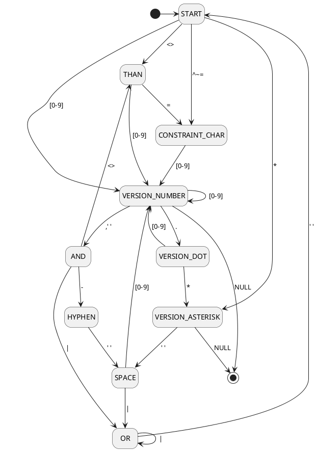

# Constraint parser automaton

```plantuml
@startuml
hide empty description

[*] -> START
START --> THAN: <>
START --> CONSTRAINT_CHAR: ^~=
START --> VERSION_NUMBER: [0-9]
START --> VERSION_ASTERISK: *
THAN --> CONSTRAINT_CHAR: =
THAN --> VERSION_NUMBER: [0-9]
CONSTRAINT_CHAR --> VERSION_NUMBER: [0-9]
VERSION_NUMBER --> VERSION_NUMBER: [0-9]
VERSION_NUMBER --> VERSION_DOT: .
VERSION_NUMBER --> AND: ,' '
VERSION_NUMBER --> [*]: NULL
VERSION_DOT --> VERSION_NUMBER: [0-9]
VERSION_DOT --> VERSION_ASTERISK: *
OR -> START: ' '
OR --> OR: |
HYPHEN --> SPACE: ' '
AND --> THAN: <>
AND --> OR: |
AND --> HYPHEN: -
SPACE --> OR: |
SPACE --> VERSION_NUMBER: [0-9]
VERSION_ASTERISK --> SPACE: ' '
VERSION_ASTERISK --> [*]: NULL


@enduml
```
